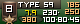
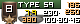

# WoT PogS-like Icon Sets

Ready-to-use PogS-like icon sets for World of Tanks — re-packed game atlases and contour icons that can be dropped
straight into the game directory. Available as raw patched resources (see PogS-* directories) or packed into `.
wotmod` format (check latest [Releases](https://github.com/pietrovich/wot-pogs-like-icon-sets/releases/latest)).

Built with [pie-wot](https://github.com/pietrovich/wot-utils) cli from **WoT 2.3.1.0** resources and whatever data could
be picked from Wargaming API. Updated periodically to follow game updates.

## What is this?

Icon sets are a type of WoT mod that replaces the default vehicle icons on the battle screen.

These are **not** the original PoGS icons — they are a replica built with a different toolset.
A pixel-perfect match was not the goal, good enough is enough; this is the subset of varieties
the author actually uses.

Anyone is welcome to use them or open an issue to request a missing variety — no promises,
but we'll see what can be done.

## Available Sets

| Directory                   | Description                    |                                                                                                                                 |
|-----------------------------|--------------------------------|---------------------------------------------------------------------------------------------------------------------------------|
| `PogS-color-simple`         | Minimalistic "Color" variety   |  |
| `PogS-clear-simple`         | Minimalistic "Clear" variety   |  |
| `PogS-color-dmg-rld-fsr-vr` | DMG-RLD-FSR-VR "Color" variety |  |
| `PogS-clear-dmg-rld-fsr-vr` | DMG-RLD-FSR-VR "Clear" variety |  |

## How to Use pre-baked icon sets

### Manual install

Copy the `flash` folder from the desired variety into your game directory:

```
{variety}/res_mods/version/gui/flash
  →
{game_directory}/res_mods/{version}/gui/flash
```

### [Aslain's Mod Pack](https://aslain.com/index.php?/topic/13-download-%E2%98%85-world-of-tanks-%E2%98%85-modpack/)

Copy set's `res_mods` folder or corresponding `.wotmod` pack from [Releases](https://github.com/pietrovich/wot-pogs-like-icon-sets/releases/latest) 
to `{game_directory}/Aslain_Modpack/Custom_mods` (there will be a folder with the same name already, 
simply overwrite the conflicting files).

It will then be automatically re-installed on every modpack update. See the README.txt in
`{game_directory}/Aslain_Modpack/Custom_mods/README.txt` for more details.

## How to re-bake icon sets

`npm i && npm run build -- --game-dir <game_directory>` will do the trick.

Though you'll need some game resources or game installation at hands and a valid
Wargaming App ID to fetch data from Wargaming API. If you don't have one, you can create it
[here](https://developers.wargaming.net/applications/), just be sure to select "Mobile" type app.
Data is cached locally, so continuous re-baking will not hammer WG servers and will be much faster after the first run.

Copy `.env.example` to `.env` and fill in the required values.

`--game-dir` is optional, needed only to find and extract necessary game's resources.
If you have `battleAtlas.dds`, `battleAtlas.xml`, `vehicleMarkerAtlas.dds` and `vehicleMarkerAtlas.xml`
extracted already you can either drop them into `./out/.atlases/` or pass the path to them via `--atlas-dir` option.

Newly baked icon sets will be saved to `./out/<set-name>`.

P.S.: Wipe WG data cache manually if you see some stale vehicle stats or after some major/re-balance game updates to
keep vehicle stats fresh.

## Credits

PoGS icons were originally created and maintained by a community of authors. The forum where they were originally
announced is gone, and not all names could be recovered. Known contributors:

- **Pogs**
- **Grepa**
- **Oxmaster**
- **Pavel Maca** — [github.com/pavelmaca/WoT-PogsIconSet](https://github.com/pavelmaca/WoT-PogsIconSet)
- **Vit4liy (Soloviyko)** — [github.com/Vit4liy/WoT-PogsIconSet](https://github.com/Vit4liy/WoT-PogsIconSet)
- @Aslain for the
  great [Mod-pack](https://aslain.com/index.php?/topic/13-download-%E2%98%85-world-of-tanks-%E2%98%85-modpack/)

Apologies to anyone missed — open an issue or ping me and I'll add you to the credits.

---

GL, HF

[](./LICENSE)
